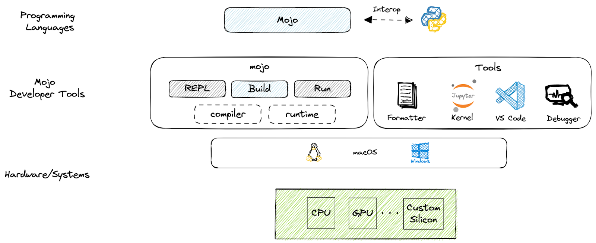

# 

Mojo is (designed to become) a superset language to Python that is specifically designed and optimized
for AI programming. It is fully interoperable with Python modules and libraries.

"Mojo gives Python superpowers." - Chris Lattner

-
-

##  Templates

<br>

##  Visual Studio Code Extensions

[Mojo ](
    https://marketplace.visualstudio.com/items?itemName=modular-mojotools.vscode-mojo)
    - extension from the Modular team adds support for the [Mojo programming
    language](https://www.modular.com/mojo).

[Mojo-lang](https://marketplace.visualstudio.com/items?itemName=CristianAdamo.mojo) - A basic
syntax highlighter for Mojo Language.

<br>

## 📝Notes

> These notes are updated on regular basis

<!--
TODO: Table of Contents

TODO: Snippets for Matrix Multiplication

TODO: Snippets for Strong Type Checking

TODO: Snippets of fn functions
- with various argument type specifications preset:
- all local variables declared:
- raising exceptions explicitly declared with 'raises' function effect (placed
  after the function argument list):

TODO: Custom Constructors

TODO: Custom Destructors

TODO: Custom Copy and Move Constructors
-->
<br>

### SDK

Currently there's only Ubuntu version of SDK (as of 9/18/2023)

<br>
A view of the Mojo SDK

<br>

### `main()` function

Mojo requires a `main()` function to run the code:

``` mojo
def main():
    print("Hello World")
```

### Importing Python modules

Example:

``` mojo
from python import Python

def main():
    # This is equivalent to Python's `import numpy as np`
    let np = Python.import_module("numpy")

    # Now use numpy as if writing in Python
    array = np.array([1, 2, 3])
    print(array)

```

> Remember to import the Python module!<br>
> `$ sudo apt install python3-numpy`<br>
> Currently Mojo error messages do not notify user that the Python module you're
> trying to import is missing.

<br>

### "Arguments" vs "Parameters"

In Python "arguments" and "parameters" are fairly interchangeable for "things
that are passed into functions." In Mojo they are different:

- "Parameters"
  - use square braces: `[...]`
  - are only compile-time values or types
- "Arguments" and "expressions"
  - use parentheses, like in Python: `(...)`
  - are runtime or compile-time values

Examples:

<br>

### Use of `fn` vs `def`

#### `fn`

- Strict: requires type annotations

#### `def`

Examples:

<br>

### @value decorator

You can think of `@value` as an extension of Python’s `@dataclass` that also handles
Mojo’s `__moveinit__` and `__copyinit__` methods.

Example:

<br>

## Bringing in Python into Mojo

There are several things that need to be changed in Python code to be able to
run it as Mojo code:
